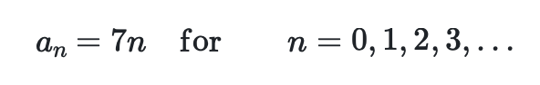
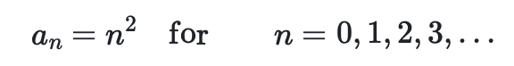

# Plotting

The times tables that we have been calculating and plotting are examples of what are called sequences.  We can use the following nomenclature to express the seven times table as a sequence:

Lets now consider the following sequence:

__Write a program that produces a graph with x values that are the first 30 n values and y values that are the first 30 values for a_n.__  Label the x-axis of the graph as __Index__ and the y-axis as __Square__. 
